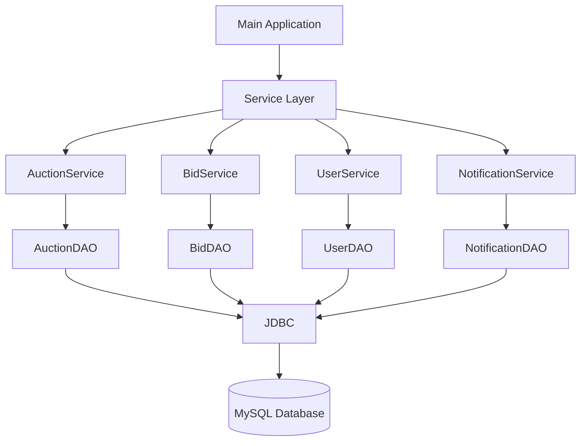

# 🔨 LiveBid — Concurrent Live Auction System

> **A Java + MySQL live auction system focused on concurrent bidding, optimistic locking, database consistency, and layered backend design.**


---

## 📌 Overview

**LiveBid** is a Java and MySQL based live auction system designed to model a backend auction workflow where multiple users can participate in the same auction and place bids concurrently.

The main technical focus is **concurrency control**. When multiple bidders attempt to update the same auction at nearly the same time, the system uses **optimistic locking with version checking** to detect conflicting updates instead of allowing one update to silently overwrite another.

The project uses a layered structure consisting of models, services, DAOs, JDBC database connectivity, custom exception handling, and MySQL persistence.

---

## 🎯 Project Objectives

- Build a structured Java backend application using a layered architecture
- Persist auction, bid, user, and notification data in MySQL
- Connect Java application logic to MySQL using JDBC
- Implement auction creation and bidding workflows
- Validate bids against the current highest bid
- Handle multiple bidders attempting to update the same auction
- Demonstrate optimistic locking and version-based conflict detection
- Handle concurrent update conflicts through retry logic
- Maintain consistent auction state

---

# ✨ Key Features

### 👤 User Management

- User creation and retrieval
- User association with bids and auction activity

### 🔨 Auction Management

- Create auctions
- Store auction details
- Define starting price
- Track current highest bid
- Maintain auction status
- Maintain auction version
- Retrieve auction information

### 💰 Bidding

- Place bids
- Validate bid amounts
- Compare bids with the current highest bid
- Update the highest bid
- Persist bid history
- Associate bids with users and auctions

### ⚡ Concurrent Bidding

Multiple bidders can attempt to place bids against the same auction.

The system detects conflicting updates using optimistic locking rather than allowing stale requests to overwrite newer auction state.

### 🔐 Optimistic Locking

Each auction maintains a version value.

Example:

```text
Auction ID       : 1
Current Bid      : ₹25,000
Version          : 1
Status           : LIVE
```

If another bidder updates the auction before a previous bidder completes its update:

```text
Expected Version : 1
Database Version : 2
```

the stale update is rejected as a conflict instead of silently overwriting the newer state.

### 🔔 Notifications

The system maintains notification records associated with users and auctions, providing a foundation for future real-time or external notification mechanisms.

---

# 🏗️ Architecture

LiveBid follows a layered backend architecture:



### Layer Responsibilities

| Layer | Responsibility |
|---|---|
| **Model** | Represents domain entities and application data |
| **Service** | Contains business logic and coordinates operations |
| **DAO** | Handles database operations using JDBC |
| **Config** | Provides database connection configuration |
| **Exception** | Handles application-specific exceptions |
| **MySQL** | Provides persistent data storage |

---

# 📂 Project Structure

```text
livebid/
│
├── src/
│   └── main/
│       └── java/
│           └── com/
│               └── sujitha/
│                   └── livebid/
│
│                       ├── Main.java
│                       │
│                       ├── config/
│                       │   └── DatabaseConnection.java
│                       │
│                       ├── dao/
│                       │   ├── AuctionDAO.java
│                       │   ├── BidDAO.java
│                       │   ├── NotificationDAO.java
│                       │   └── UserDAO.java
│                       │
│                       ├── exception/
│                       │   └── OptimisticLockException.java
│                       │
│                       ├── model/
│                       │   ├── Auction.java
│                       │   ├── AuctionStatus.java
│                       │   ├── Bid.java
│                       │   ├── Notification.java
│                       │   └── User.java
│                       │
│                       └── service/
│                           ├── AuctionService.java
│                           ├── BidService.java
│                           ├── NotificationService.java
│                           └── UserService.java
│
├── pom.xml
├── .gitignore
└── README.md
```

---

# 🧩 Core Components

## Model Layer

### `Auction`

Represents an auction and its current state, including:

- Auction ID
- Item/product information
- Starting price
- Current highest bid
- Auction status
- Version used for optimistic locking

### `Bid`

Represents an individual bid placed by a user for an auction.

### `User`

Represents a participant in the auction system.

### `Notification`

Represents a persisted notification associated with auction activity.

### `AuctionStatus`

Represents the lifecycle state of an auction.

---

## DAO Layer

The DAO layer separates database operations from business logic.

### `AuctionDAO`

Responsible for auction persistence and version-aware auction updates.

### `BidDAO`

Responsible for bid persistence and bid-related database operations.

### `UserDAO`

Responsible for user persistence and retrieval.

### `NotificationDAO`

Responsible for notification persistence and retrieval.

This separation keeps SQL/JDBC operations outside the service layer and improves maintainability.

---

## Service Layer

### `AuctionService`

Handles auction-related business operations such as:

- Auction creation
- Auction retrieval
- Auction state management

### `BidService`

Contains the core bidding logic:

```text
Receive Bid
    ↓
Validate Bid
    ↓
Read Current Auction State
    ↓
Check Highest Bid
    ↓
Read Auction Version
    ↓
Attempt Version-Aware Update
    ↓
Update Successful?
   /             \
 YES              NO
  |                |
  ▼                ▼
Accept Bid     Optimistic Lock
                  Conflict
                     |
                     ▼
               Retry / Handle
```

### `UserService`

Handles user-related business operations.

### `NotificationService`

Handles notification-related business operations.

---

# ⚡ Concurrency Design

Concurrency is the primary technical focus of LiveBid.

Consider an auction with:

```text
Current Highest Bid = ₹25,000
Version             = 1
```

Two bidders attempt to place bids at approximately the same time:

```text
Bidder #2 → ₹27,000
Bidder #3 → ₹28,000
```

Both operations may initially read the same auction version.

The system uses the auction version to detect whether the auction has changed between reading and updating.

Conceptually, the database update follows this pattern:

```sql
UPDATE auction
SET highest_bid = ?,
    version = version + 1
WHERE id = ?
  AND version = ?;
```

If the expected version no longer matches the database version, the update is considered a conflict.

This prevents a stale transaction from blindly overwriting a newer auction state.

---

# 🔐 Optimistic Locking Flow

```text
              Read Auction
                   │
                   ▼
          Read Current Version
                   │
                   ▼
             Validate Bid
                   │
                   ▼
        Attempt Database Update
                   │
             ┌─────┴─────┐
             │           │
          Success      Conflict
             │           │
             ▼           ▼
        Bid Accepted   Version Mismatch
                         │
                         ▼
                 OptimisticLockException
                         │
                         ▼
                   Retry / Handle
```

The project contains a custom:

```text
OptimisticLockException
```

to represent optimistic-lock conflicts explicitly.

---

# 🧪 Concurrency Testing

The system was tested using concurrent bidding scenarios.

Example:

```text
Auction:
Sony WH-1000XM5 Headphones

Starting Price:
₹25,000

Concurrent Bidders:
Bidder #2
Bidder #3
```

A representative execution flow is:

```text
Auction Created
      ↓
Version = 1
      ↓
Bidder #2 and Bidder #3 attempt bids
      ↓
One transaction successfully updates the auction
      ↓
Auction version increments
      ↓
The competing transaction detects a version mismatch
      ↓
Optimistic lock conflict is detected
      ↓
Retry / conflict handling is performed
```

This demonstrates how optimistic locking can protect shared auction state when multiple users compete for the same resource.

---

# 🗃️ Database Design

MySQL is used for persistent storage.

The application contains data associated with:

```text
Users
Auctions
Bids
Notifications
```

The Java application communicates with MySQL through JDBC.

Database connectivity is centralized through:

```text
src/main/java/com/sujitha/livebid/config/DatabaseConnection.java
```

The DAO classes use the database connection to execute SQL operations.

---

# 🛠️ Technology Stack

| Technology | Purpose |
|---|---|
| **Java 21** | Core application and business logic |
| **MySQL** | Relational database |
| **JDBC** | Database connectivity |
| **Maven** | Build and dependency management |
| **IntelliJ IDEA** | Development environment |
| **Git** | Version control |
| **GitHub** | Source code hosting |

---

# 📋 Prerequisites

Install the following before running the project:

- JDK 21 or compatible JDK
- MySQL Server
- MySQL Workbench or MySQL client
- Maven
- Git
- IntelliJ IDEA or another Java IDE

---

# 🚀 How to Run

## 1. Clone the Repository

```bash
git clone https://github.com/sujithakrishna/livebid-auction-system.git
cd livebid-auction-system
```

## 2. Create the MySQL Database

Create the required MySQL database and tables according to the schema expected by the application.

Make sure the MySQL server is running before starting the Java application.

## 3. Configure Database Credentials

Open:

```text
src/main/java/com/sujitha/livebid/config/DatabaseConnection.java
```

Configure:

```text
Database URL
Username
Password
```

**Do not commit real passwords or other credentials to GitHub.**

For production applications, credentials should be supplied through environment variables or external configuration.

## 4. Build the Project

From the project root:

```bash
mvn clean package
```

## 5. Run the Application

Run:

```text
src/main/java/com/sujitha/livebid/Main.java
```

from IntelliJ IDEA or your preferred Java environment.

---

# 🔄 Application Workflow

```text
User
  │
  ▼
Create / Access Auction
  │
  ▼
Auction Status = LIVE
  │
  ▼
Place Bid
  │
  ▼
Validate Bid
  │
  ▼
Read Current Auction State
  │
  ▼
Validate Version
  │
  ├───────────────┐
  │               │
  ▼               ▼
Valid           Conflict
  │               │
  ▼               ▼
Update        Retry / Handle
Auction
  │
  ▼
Increment Version
  │
  ▼
Persist Bid
  │
  ▼
Create Notification
```

---

# 📊 Example Scenario

An auction starts with:

```text
Product          : Sony WH-1000XM5 Headphones
Starting Price   : ₹25,000
Status           : LIVE
Version          : 1
```

A bidder places:

```text
Bid = ₹27,000
```

If the version is still valid:

```text
Highest Bid → ₹27,000
Version     → 2
```

If another bidder has already updated the auction:

```text
Expected Version → 1
Actual Version   → 2
```

the stale update is rejected as a concurrency conflict rather than overwriting the latest auction state.

---

# 💡 Why Optimistic Locking?

Optimistic locking is useful when conflicts are possible but continuous database locking is undesirable.

Instead of locking the auction row for the entire bidding operation, the application assumes that conflicts can occur and verifies the version at update time.

This provides:

- Conflict detection
- Protection against lost updates
- Better concurrency
- Explicit handling of stale data
- A foundation for scalable concurrent operations

---

# 📈 Future Enhancements

The current Java + MySQL implementation can be extended with:

- REST APIs
- WebSocket-based real-time bidding
- Authentication and authorization
- JWT security
- Redis caching
- Message queues
- Real-time notifications
- Auction scheduling
- Automatic auction closing
- Bid history dashboards
- Email notifications
- Distributed locking
- Docker deployment
- Cloud deployment
- Centralized logging
- Monitoring and observability
- Automated tests

> These are future extensions and are not part of the current Java + MySQL implementation.

---

# 🎓 What This Project Demonstrates

LiveBid demonstrates practical understanding of:

- Core Java
- Object-Oriented Programming
- Exception handling
- JDBC
- MySQL
- SQL-based persistence
- DAO pattern
- Service-layer architecture
- Separation of concerns
- Concurrent programming concepts
- Optimistic locking
- Version-based conflict detection
- Retry mechanisms
- Transaction consistency
- Shared-state concurrency
- Git and GitHub

---

# ⭐ Project Highlights

| Area | Implementation |
|---|---|
| **Language** | Java |
| **Database** | MySQL |
| **Connectivity** | JDBC |
| **Architecture** | Model + Service + DAO |
| **Concurrency** | Optimistic locking |
| **Conflict handling** | Version checking + retry flow |
| **Persistence** | MySQL |
| **Build** | Maven |
| **Version Control** | Git |
| **Repository** | GitHub |

---

# 👩‍💻 Author

**Sujitha V K**

Java • SQL • Backend Development

**GitHub:**  
https://github.com/sujithakrishna

**LinkedIn:**  
https://www.linkedin.com/in/sujitha-v-k-77a924258/

---

# 🔗 Repository

**LiveBid — Concurrent Live Auction System**

https://github.com/sujithakrishna/livebid-auction-system

---

<p align="center">
  <strong>Built with Java ☕ • MySQL 🗄️ • JDBC 🔌 • Concurrency ⚡</strong>
</p>
